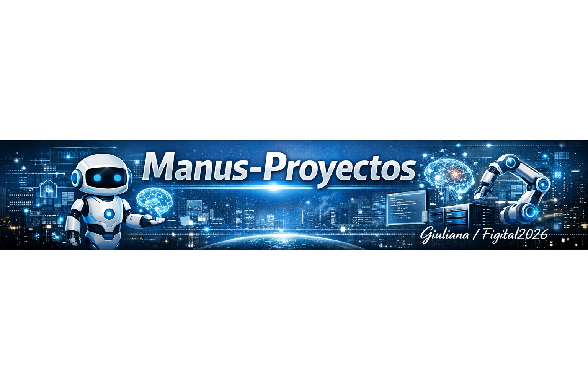

# Manus-Proyectos 🚀

**Repositorio principal de trabajo para proyectos de IA creados en colaboración con Manus.**

Este es el espacio centralizado donde se organizan, desarrollan y documentan todos los proyectos relacionados con Inteligencia Artificial, automatización y estrategia digital.

---

## 📂 Estructura del Repositorio

```
Manus-Proyectos/
├── Focus360/              ← Proyectos de IA y Estrategia Digital
│   ├── README.md
│   └── WELCOME.md
├── README.md              ← Este archivo
└── [Otros proyectos]
```

## 🎯 Proyectos Actuales

### Focus360
Repositorio dedicado a proyectos de **Inteligencia Artificial**, incluyendo:
- Exploración de modelos de lenguaje avanzados
- Automatización de flujos de trabajo
- Análisis de datos y generación de contenido inteligente

**Ubicación**: `/Focus360`

---

## 🛠️ Tecnologías Utilizadas

- **Manus AI**: Agente autónomo para ejecución de tareas complejas
- **GitHub CLI**: Gestión eficiente del repositorio
- **Python/Node.js**: Entornos de ejecución
- **IA & Automatización**: Modelos de lenguaje, Machine Learning

---

## 📝 Cómo Usar Este Repositorio

1. Navega a la carpeta del proyecto específico (ej: `/Focus360`)
2. Lee el `README.md` de ese proyecto para instrucciones detalladas
3. Consulta el `WELCOME.md` para una introducción rápida

---

## 🔗 Enlaces Relacionados

- **GitHub Profile**: [GiuliaFigital2026](https://github.com/GiuliaFigital2026)
- **Focus360Manus**: [Repositorio dedicado](https://github.com/GiuliaFigital2026/Focus360Manus)
- **Portafolio Personal**: [GiuliaFigital2026 Profile](https://github.com/GiuliaFigital2026/GiuliaFigital2026)

---

**Creado con ❤️ por GiuliaFigital2026 y Manus**

#StayCurious | #Figital2026 | #Skills2026